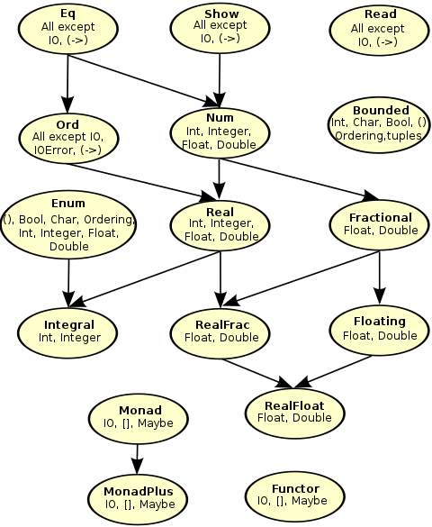

# Typeclasses

- Type declaration specifies how a type is *created*, but typeclass declaration
specifies how a set of types are *consumed* (creation versus usage).
- Typeclasses are like *interfaces* in different languages - which allows reuse
of functionality across multiple datatypes.
- Typeclasses allow generalization of shared features:
  - e.g. `#!hs Eq` typeclass instances can be tested for equality.

## Bool

The data type `#!hs Bool` is declared to be instances of many typeclasses:

```haskell
Prelude> :info Bool

data Bool = False | True

instance Bounded Bool
instance Enum Bool
instance Eq Bool
instance Ord Bool
instance Read Bool
instance Show Bool
```

## Eq

Equality in Haskell is expressed by implementing the `#!hs Eq` typeclass.

The `#!hs Eq` typeclass is defined as

```haskell
Prelude> :info Eq
class Eq a where
    (==) :: a -> a -> Bool
    (/=) :: a -> a -> Bool
```

Such typeclass definition tells us that any types implementing it is required to
supply definitions for `#!hs (==)` and `#!hs (/=)`, and code using `#!hs Eq` as
constraints can rely on the equals-to and not-equals-to operations being defined
on the supplied arguments.

GHCi also lists its instances:

```haskell
instance Eq a => Eq [a]
instance Eq Ordering
instance Eq Int
instance Eq Float
instance Eq Double
instance Eq Char
instance Eq Bool
instance (Eq a, Eq b) => Eq (a, b)
instance Eq ()
instance Eq a => Eq (Maybe a)
instance Eq Integer
```

## Defining Typeclass Instances

### Eq Instances

Each typeclass has a *minimal complete definition*. For `Eq`, it is either
`#!hs (==)` or `#!hs (/=)`. Both are provided as part of the definition since
it may be possible that the definition for each contains opportunity to
optimize independently.

!!! example "Trivial datatype"
    ```haskell
    data Trivial = Trivial'

    instance Eq Trivial where
        Trivial' == Trivial' = True
    ```

!!! example "Weekday"
    ```haskell
    data DayOfWeek = 
        Monday | Tuesday | Wednesday | Thursday | Friday | Saturday | Sunday
    
    data Date = Date DayOfWeek Int

    instance Eq DayOfWeek where
        (==) Monday Monday          = True
        (==) Tuesday Tuesday        = True
        (==) Wednesday Wednesday    = True
        (==) Thursday Thursday      = True
        (==) Friday Friday          = True
        (==) Saturday Saturday      = True
        (==) Sunday Sunday          = True
        (==) _ _                    = False
    
    instance Eq Date where
        (==) (Date weekDay dayOfMonth) (Date weekDay' dayOfMonth') =
            weekDay == weekDay' && dayOfMonth == dayOfMonth'
    ```

### Partial Functions

Sometimes not all possible cases are handled. This danger can be mitigated by
turning on `-Wall` warning flags in the GHC.

### Typeclasses with Additional Arguments

!!! example "Identity typeclass"
    ```haskell
    data Identity a = Identity a

    instance Eq a => Eq (Identity a) where
        (==) (Identity v) (Identity v') = v == v'
    ```

## Num Typeclass

```haskell
class Num a where
    (+) :: a -> a -> a
    (*) :: a -> a -> a
    (-) :: a -> a -> a
    negate :: a -> a
    abs :: a -> a
    signum :: a -> a
    fromInteger :: Integer -> a
```

Some of its instances include:

```haskell
instance Num Integer
instance Num Int
instance Num Float
instance Num Double
```

### Integral Typeclass

```haskell
class (Real a, Enum a) => Integral a where
    quot :: a -> a -> a
    rem :: a -> a -> a
    div :: a -> a -> a
    mod :: a -> a -> a
    quotRem :: a -> a -> (a, a)
    divMod :: a -> a -> (a, a)
    toInteger :: a -> Integer
```

### Fractional Typeclass

```haskell
class Num a => Fractional a where
    (/) :: a -> a -> a
    recip :: a -> a
    fromRational :: Rational -> a
```

## Ord Typeclass

```haskell
class Eq a => Ord a where
    compare :: a -> a -> Ordering
    (<) :: a -> a -> Bool
    (<=) :: a -> a -> Bool
    (>) :: a -> a -> Bool
    (>=) :: a -> a -> Bool
    max :: a -> a -> a
    min :: a -> a -> a
```

Notable instances include:

```haskell
instance Ord a => Ord (Maybe a)
instance (Ord a, Ord b) => Ord (Either a b)
instance Ord Integer
instance Ord a => Ord [a]
instance Ord Ordering
instance Ord Int
instance Ord Float
instance Ord Double
instance Ord Char
instance Ord Bool
```

Since ordering requires equality, `Ord` is a subclass of `Eq`.

## Enum Typeclass

The `#!hs Enum` typeclass describes types which are enumerable; types for which
there exists known precedessors and successors.

```haskell
class Enum a where
    succ :: a -> a
    pred :: a -> a
    toEnum :: Int -> a
    fromEnum :: a -> Int
    enumFrom :: a -> [a]
    enumFromThen :: a -> a -> [a]
    enumFromTo :: a -> a -> [a]
    enumFromThenTo :: a -> a -> a -> [a]
```

Some notable instances include:

```haskell
instance Enum Ordering
instance Enum Integer
instance Enum Int
instance Enum Char
instance Enum Bool
instance Enum ()
instance Enum Float
instance Enum Double
```

## Show

The `#!hs Show` typeclass specifies how human-readable string representations
of data types are created.

!!! warning "Not for serialization"
    The `#!hs Show` typeclass must *not* be used for serialization; it must
    only be used for debugging purposes and for creating human-readable
    representations.

The `#!hs Show` typeclass' essential part is defined as

```haskell
class Show a where
    showsPrec :: Int -> a -> ShowS
    show :: a -> String
    showList :: [a] -> ShowS
```

With notable instances including:

```haskell
instance Show a => Show [a]
instance Show Ordering 
instance Show a => Show (Maybe a)
instance Show Integer
instance Show Int
instance Show Char
instance Show Bool
instance Show ()
instance Show Float
instance Show Double
``` 

## Printing and Side Effects

The `#!hs print` function defined in `Prelude` is defined with the type

```haskell
print :: Show a => a -> IO ()
```

The result is an `#!hs IO` action with the value of type `#!hs ()`.

The entry point `#!hs main` is also required to have the return type of some
`#!hs IO a` with `#!hs a` being some arbitary type, since running `#!hs main`
only produces side-effects.

The `#!hs ()` is an empty tuple, read as an "*Unit*", representing lack of
meaningful value.

## Read Typeclass

!!! warning "Avoid using Read"
    The `#!hs Read` typeclass's `#!hs read` function is defined with type

    ```haskell
    read :: Read a => String -> a
    ```

    But not every string can be successfully parsed into the desired value; it
    is most likely a partial function and as such may throw exceptions.

## Typeclass Dispatching

- Typeclasses are dispatched by type.
- Typeclasses are defined by set of operations and values all of its instances
provide.
- Typeclass instances pair the typeclass with a specific type and are the ways
to implement the typeclass methods for the type.

## Typeclass Inheritance Hierarchy (Partial)


